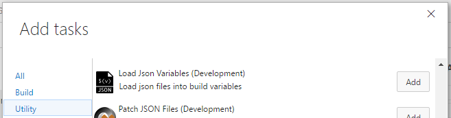

# Variables Helpers Build and Release Tasks

Visual Studio Team Services Build and Release Management extensions that help you manipulate and load variables.

[Learn more](https://github.com/geeklearningio/gl-vsts-tasks-variables/wiki) about this extension on the wiki!

## Tasks included

* **[Load JSON Variables](https://github.com/geeklearningio/gl-vsts-tasks-variables/wiki/Load-JSON-Variables)**: Load variables from a JSON file

## Steps

After installing the extension, you can add one (or more) of the tasks to a new or existing [build definition](https://www.visualstudio.com/en-us/docs/build/define/create) or [release definition](https://www.visualstudio.com/en-us/docs/release/author-release-definition/more-release-definition)

## Learn more

The [source](https://github.com/geeklearningio/gl-vsts-tasks-variables) for this extension is on GitHub. Take, fork, and extend.

## Release Notes

> **8-4-2016**
> - Added: Load JSON Variables
